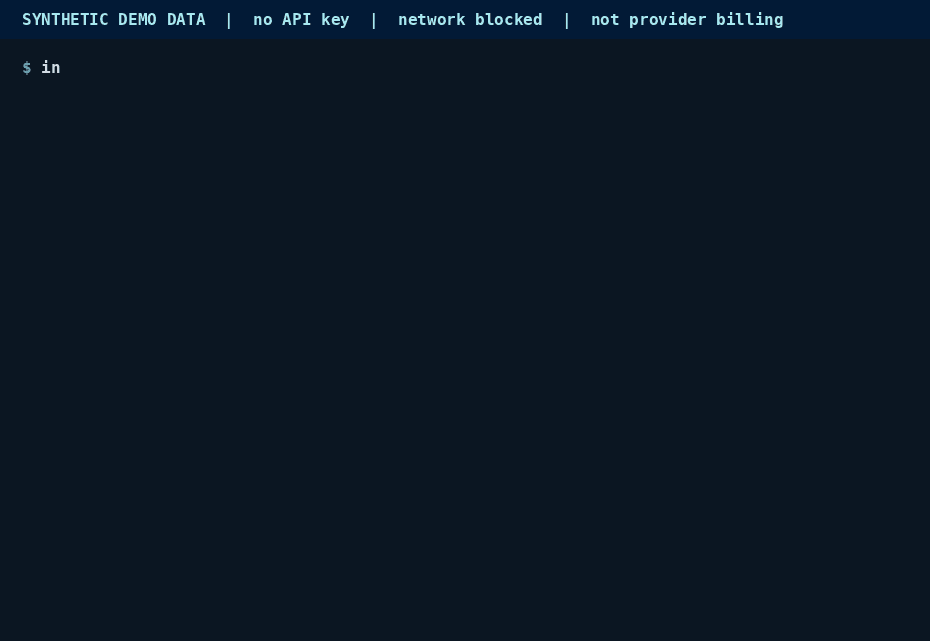

<!-- mcp-name: io.github.domondi1/inferrail -->

<p align="center">
  
</p>

<h1 align="center">Know what your AI work costs.<br>Without keeping what it said.</h1>

<p align="center">
Inferrail is a gateway you run yourself that tracks token usage and estimated LLM cost by customer, workflow, or task for its supported OpenAI and Anthropic endpoints.
</p>

<p align="center">
  <a href="https://github.com/domondi1/inferrail/actions/workflows/ci.yml"></a>
  <a href="https://pypi.org/project/inferrail/"></a>
  <a href="https://pypi.org/project/inferrail/"></a>
  <a href="LICENSE"></a>
  
</p>

<p align="center">
  <a href="#try-it-offline">Try locally</a> ·
  <a href="#how-it-works">How it works</a> ·
  <a href="#privacy-boundary">Privacy</a> ·
  <a href="#integrations">Integrations</a> ·
  <a href="#status">Status</a> ·
  <a href="#documentation">Docs</a>
</p>

**Open source under [Apache-2.0](LICENSE).** Developer preview: the
features below are implemented and tested, but CLI flags, config shape,
and receipt fields may still change before 1.0.

## Privacy boundary

For each supported request, the gateway writes one receipt to a local
file. This is a real receipt from the offline demo below.

**Example receipt: synthetic demo data, abbreviated.**

```json
{
  "receipt_id": "ir_4090e812f2ba4d3680e7",
  "route": "default",
  "provider": "demo",
  "model": "demo-small",
  "status": "success",
  "prompt_tokens": 812,
  "completion_tokens": 143,
  "pricing": {
    "input_usd_per_million": "0.20",
    "output_usd_per_million": "0.80",
    "source": "DEMO — a made-up round number, not a real provider price",
    "verified_date": "2026-09-26"
  },
  "estimated_cost_usd": "0.000277",
  "attributes": {"customer": "acme", "workflow": "contract-review", "work_id": "work-contract-1"}
}
```

Omitted here: `request_id`, `timestamp`, `total_latency_ms`, `retry_count`.
Full field list: [receipts/schema.py](src/inferrail/receipts/schema.py).

**What happens to your key and your content (self-hosted):**

- Your gateway process reads the provider key from its own environment
  and sends requests to the provider you configure.
- It processes prompts and responses in memory to forward them. The
  provider still receives your request content, under its own policies.
- Receipts record usage, cost evidence, status, timing, and the
  attribution you supply. The receipt path does not copy message bodies.
- Attribution tags are stored exactly as sent. Use identifiers, and keep
  secrets and message content out of them.
- Local telemetry events are operational metadata. The optional usage
  beacon is separate and sends nothing unless you configure a collector
  endpoint ([details](docs/privacy/usage-ping.md)).
- The [hosted trial](#status) is a different boundary: if you add a real
  key there, the hosted process holds that key and handles your traffic.

**Check it yourself:**
[request handlers](src/inferrail/gateway/routes.py) ·
execution engines ([OpenAI](src/inferrail/gateway/execution.py), [Anthropic](src/inferrail/gateway/anthropic_execution.py)) ·
provider adapters ([OpenAI](src/inferrail/providers/openai.py), [Anthropic](src/inferrail/providers/anthropic.py)) ·
[receipt builder](src/inferrail/receipts/builder.py) ·
sinks ([JSONL](src/inferrail/receipts/sinks.py), [SQLite](src/inferrail/receipts/sqlite_store.py)) ·
canary tests ([OpenAI](tests/unit/test_gateway_receipts.py), [streaming and telemetry](tests/unit/test_gateway.py), [Anthropic](tests/unit/test_gateway_anthropic.py)).

`inferrail verify-payload-free` prints the live receipt schema and checks
that no field is named for message content. It is a schema check, not a
security audit: it cannot inspect stored values, logs, or your provider.

## Try it offline

Requires Python 3.11+. Installing downloads the package and its
dependencies; after that, the demo runs offline.

```bash
python -m pip install inferrail
inferrail demo
inferrail report --by customer --receipts ./inferrail-demo-receipts.jsonl
```

The demo needs no API key, makes no network calls, and creates no
provider charges. It sends six scripted requests through the real engine
with a fake provider and made-up prices labeled `DEMO`, then writes
`./inferrail-demo-receipts.jsonl` in your current directory.

<details>
<summary>Setting up Python or fixing <code>command not found</code></summary>

```bash
python3 -m venv .venv && source .venv/bin/activate   # Windows: .venv\Scripts\activate
python -m pip install inferrail
```

If `inferrail` is still not found, the environment is not active or pip
installed into a different Python. More in
[docs/self-hosting.md](docs/self-hosting.md#install).
</details>

<p align="center">
  
</p>

<p align="center"><sub>
Real run of <code>inferrail demo</code> 0.4.3 with networking blocked. Synthetic data, not provider billing.
<a href="docs/assets/inferrail-demo-poster.png">Static image</a> ·
<a href="docs/assets/demo-capture/">captured output</a> ·
<a href="scripts/render_demo_gif.py">how it was made</a>
</sub></p>

In the report, `acme` shows one request with **unknown cost**: the demo's
preview model has no price on file, so its receipt has
`"pricing": null` and `"estimated_cost_usd": null`. The `COST (USD)`
column adds up known costs only. It is not a complete bill when the
unknown count is above zero.

## Send a real request

This uses your own provider account, which bills you as usual. Run the
gateway in one terminal, with the key set **in that terminal**, because
the gateway is the process that calls the provider:

```bash
export OPENAI_API_KEY=...        # and/or ANTHROPIC_API_KEY=...
inferrail serve --quickstart
```

Then point your client at it from another terminal or your app:

```python
from openai import OpenAI

client = OpenAI(base_url="http://127.0.0.1:8000/v1", api_key="not-needed")
client.chat.completions.create(
    model="gpt-4o-mini",
    messages=[{"role": "user", "content": "Say hello in five words."}],
    extra_headers={"X-Inferrail-Attribute-Customer": "acme"},
)
```

```python
import anthropic

# No /v1 here: the Anthropic SDK adds /v1/messages itself.
client = anthropic.Anthropic(base_url="http://127.0.0.1:8000", api_key="not-needed")
client.messages.create(
    model="claude-haiku-4-5-20251001",
    max_tokens=256,
    messages=[{"role": "user", "content": "Say hello in five words."}],
)
```

The client's `api_key` is a placeholder; the gateway ignores it unless
you set `INFERRAIL_GATEWAY_TOKEN`. Then run `inferrail report --by customer`
in the gateway's directory. The gateway listens only on `127.0.0.1` by
default. Set `INFERRAIL_GATEWAY_TOKEN` before exposing it anywhere else
([SECURITY.md](SECURITY.md)).

## How it works

<picture>
  <source media="(prefers-color-scheme: dark)" srcset="docs/assets/inferrail-flow-dark.svg">
  
</picture>

Each request is routed by `model` to a configured provider
([routing](src/inferrail/routing/router.py)), executed with retries, and
measured. Cost is computed only when the provider reports usage and a
verified price is on file; otherwise it stays `null`, never a guessed
`$0` ([calculator](src/inferrail/receipts/calculator.py)). Architecture:
[docs/ARCHITECTURE.md](docs/ARCHITECTURE.md). Diagram source:
[scripts/render_flow_svg.py](scripts/render_flow_svg.py).

## Integrations

Supported today: `POST /v1/chat/completions` (OpenAI-compatible, with
streaming and tool calls), `POST /v1/messages` (Anthropic-compatible,
with streaming and tool use), and `GET /health`. Any client or framework
that lets you set a base URL and sends those shapes can use the gateway.
Attribution, work grouping, framework examples, and MCP setup are in
[docs/integrations.md](docs/integrations.md).

**Voice agents.** Inferrail has no native voice support. A voice stack
can route its **text LLM stage** through Inferrail if that stage accepts
a custom OpenAI- or Anthropic-compatible base URL and sends a supported
request shape. Only that stage's tokens and cost are recorded. Audio,
speech-to-text, text-to-speech, the Realtime API, and full call cost are
not covered, and no voice framework has been tested by this project
([details](docs/integrations.md#voice-agents)).

## Status

| Capability | Status |
|---|---|
| Text LLM gateway, cost receipts, reports, attribution | **Available** in the 0.4.3 developer preview on PyPI |
| Work grouping and application-declared outcomes | **Available**. Reports known cost only and counts unknown-cost receipts separately |
| Budget checks | **Available**, opt-in. Applies only to supported requests through this gateway; unpriced models are not checked ([details](docs/self-hosting.md#budgets)) |
| Local dashboard (`serve --app-mode`), read-only MCP tools | **Available**. Dashboard ships in the PyPI wheel; MCP needs `inferrail[mcp]` |
| AP invoice-exception recovery (`inferrail ap demo`) | **Experimental** workflow with a bounded contract ([docs](docs/capabilities/ap-invoice-exception-recovery.md)) |
| Hosted cost-gateway trial ([tryinferrail.com/try](https://tryinferrail.com/try/)) | **Preview**. With a real key, the hosted process holds it in memory, and the trial expires within 4 hours of adding it ([key handling](hosted/cost_gateway/README.md)) |
| Hosted Work Economics and Economic Authority | **Experimental**, Base Sepolia testnet only. Work Economics: [docs](docs/capabilities/work-economics.md), [example](examples/work_economics_purchase.py). Economic Authority: [docs](docs/capabilities/economic-authority.md), [example](examples/economic_authority_session.py) |
| Referral rewards, paid tiers | **Planned**. Not part of the package |
| Audio, speech-to-text, text-to-speech, Realtime API, embeddings, images, batch | **Not supported** |
| Providers beyond OpenAI- and Anthropic-compatible APIs (Gemini, Bedrock native) | **Not supported** |

Inferrail does not account for all spending on a provider account, only
the supported requests that pass through a running gateway. Full scope
and non-goals: [docs/PRODUCT.md](docs/PRODUCT.md).

## Documentation

- [docs/integrations.md](docs/integrations.md): clients, attribution, work tracking, voice, MCP
- [docs/self-hosting.md](docs/self-hosting.md): install, configuration, storage, budgets, dashboard
- [docs/PRODUCT.md](docs/PRODUCT.md): exact current scope
- [docs/ARCHITECTURE.md](docs/ARCHITECTURE.md) and [docs/adr/](docs/adr/): how and why it is built this way
- [docs/privacy/usage-ping.md](docs/privacy/usage-ping.md): the usage beacon
- [openapi.json](openapi.json), [config.schema.json](config.schema.json), [llms.txt](llms.txt): machine-readable references

## Feedback, security, license

- Questions and bugs: [GitHub issues](https://github.com/domondi1/inferrail/issues).
- Security or privacy vulnerabilities: please report privately, as described in [SECURITY.md](SECURITY.md).
- Contributing: [CONTRIBUTING.md](CONTRIBUTING.md). `pytest` needs no API key or network.
- License: [Apache-2.0](LICENSE).
