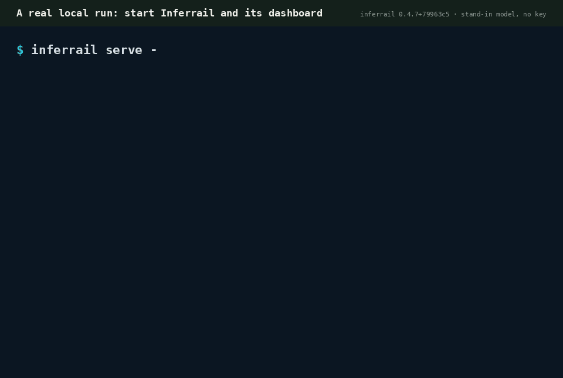

<!-- mcp-name: io.github.domondi1/inferrail -->

<p align="center">
  
</p>

<h1 align="center">Know what your AI work costs.<br>Without keeping what it said.</h1>

<p align="center">
Inferrail is a gateway you run yourself, between your app and OpenAI or Anthropic.
It shows what each AI job costs, blocks calls that would push a job past its spending limit,
and doesn't copy prompts or responses into its records.
</p>

<p align="center">
  <a href="https://github.com/domondi1/inferrail/actions/workflows/ci.yml"></a>
  <a href="https://pypi.org/project/inferrail/"></a>
  <a href="LICENSE"></a>
</p>

<p align="center">
  <a href="#quickstart"><b>Quickstart</b></a> ·
  <a href="#privacy-boundary">Where your data goes</a> ·
  <a href="#how-it-works">How it works</a> ·
  <a href="#documentation">Docs</a> ·
  <a href="https://tryinferrail.com/">tryinferrail.com</a>
</p>

<p align="center">
  
</p>

<p align="center"><em>A real run of the Inferrail gateway and dashboard, with a local stand-in model: no API key, no provider charges. <a href="docs/assets/dashboard-capture/">How it was recorded</a></em></p>

**Developer preview.** Everything below is implemented and tested.
CLI flags, config, and receipt fields may still change before 1.0.

## Quickstart

Requires Python 3.11+.

**Protect one run, inside your Python app.** No config file and no
second terminal:

```bash
pip install inferrail
export OPENAI_API_KEY=sk-...
```

```python
import inferrail
from openai import OpenAI

base_url = inferrail.start()   # the gateway, on a background thread in this process
client = OpenAI(base_url=base_url, api_key="unused")
client.chat.completions.create(
    model="gpt-4o-mini",   # example: any model your account can use (`inferrail models` lists them)
    max_tokens=200,
    messages=[{"role": "user", "content": "Summarize this contract."}],
    extra_headers={
        "X-Inferrail-Attribute-Work-Id": "contract-review-42",   # the run
        "X-Inferrail-Budget-Usd": "0.50",                        # its dollar ceiling
    },
)
```

Every call that carries the same run id shares that budget, including
parallel calls. A call that would push the run past it gets HTTP 402
before it reaches OpenAI. Then:

```bash
inferrail work contract-review-42
```

shows what the run cost.

Inferrail doesn't choose a model: whatever model id you send is passed to
the provider. A dollar budget needs a price for that model; `inferrail
models` shows which models have one, and `inferrail.start(pricing=...)`
adds a price for a new model. Framework snippets (LangChain, LangGraph,
OpenAI Agents SDK, CrewAI, Haystack, LlamaIndex, Microsoft Agent Framework):
[recipe](docs/recipes/agent-run-budget.md#framework-snippets).

**Try it offline.** No API key, no network calls, no provider charges:

```bash
pip install inferrail
inferrail demo
inferrail report --by customer --receipts ./inferrail-demo-receipts.jsonl
```

The demo sends scripted requests through the real engine to a fake
provider with made-up prices labeled `DEMO`, and prints what they cost by
customer ([recording](docs/assets/inferrail-demo.gif)).

**Run it as its own process, with the local dashboard.** For a gateway
shared by several apps, or to watch calls live, set your key in the
gateway's terminal:

```bash
export OPENAI_API_KEY=sk-...          # and/or ANTHROPIC_API_KEY
inferrail serve --quickstart --app-mode
```

Open the `Dashboard:` URL it prints, then point your app at the gateway
and tag the work:

```python
from openai import OpenAI

# api_key is a placeholder: your provider key stays in the gateway
client = OpenAI(base_url="http://127.0.0.1:8000/v1", api_key="unused")
client.chat.completions.create(
    model="gpt-4o-mini",   # example model id; Inferrail passes yours through
    messages=[{"role": "user", "content": "Summarize this contract."}],
    extra_headers={
        "X-Inferrail-Attribute-Customer": "acme",
        "X-Inferrail-Attribute-Work-Id": "contract-review-42",
        "X-Inferrail-Budget-Usd": "0.50",   # optional: a dollar ceiling for this work
    },
)
```

The call appears in the Live Feed, and the Work screen totals what
`contract-review-42` cost. The Anthropic SDK works the same way with
`base_url="http://127.0.0.1:8000"` (no `/v1`). More clients and
frameworks: [docs/integrations.md](docs/integrations.md).

<details>
<summary>Setting up Python, or <code>inferrail: command not found</code></summary>

```bash
python3 -m venv .venv && source .venv/bin/activate   # Windows: .venv\Scripts\activate
python -m pip install inferrail
```

If `inferrail` is still not found, the environment isn't active or pip
installed into a different Python. More in
[docs/self-hosting.md](docs/self-hosting.md#install).
</details>

## What you get

- **Cost per unit of work.** Tag calls with any attribute (`customer`,
  `workflow`, `work_id`, …). The dashboard and `inferrail report --by <tag>`
  total known cost by those tags, and `inferrail work <id>` shows one job.
- **A dollar budget for one agent run.** Declare it in a header. Parallel
  calls share it safely, and calls that would exceed it get HTTP 402
  before they reach the provider. Global, project, daily, and monthly
  budgets too. [Recipe](docs/recipes/agent-run-budget.md).
- **Numbers you can trust.** A cost is recorded only when the provider
  reports usage and a price is on file. Otherwise it's `unknown`, never a
  guessed `$0`.
- **Local records.** Receipts are SQLite or JSONL files on your machine.
  No Inferrail account or hosted service is involved.
- **Ask your agent.** A read-only [MCP server](#mcp) answers questions
  like *"How much did work contract-review-42 cost?"*

## Privacy boundary

| Where | What it sees or keeps |
|---|---|
| **Your provider** | The full request, exactly as it would without Inferrail, under the provider's own policies. |
| **The gateway, in memory** | Your provider key (from its own environment) and the prompts and responses it forwards. |
| **Receipts, on your disk** | Provider, model, token usage, the price used and the cost, status, timing, and the attribution tags you send. |
| **Not in receipts** | Prompt and response bodies. |

Attribution tags are stored exactly as sent, so use identifiers and keep
secrets and message content out of them. `inferrail verify-payload-free`
prints the live receipt schema, and canary tests check that message
bodies never reach receipts. Neither is a security audit. The optional
usage beacon sends nothing unless an endpoint is configured
([details](docs/privacy/usage-ping.md)). How to check all of this
yourself: [docs/PRODUCT.md](docs/PRODUCT.md#verifying-privacy-claims-yourself).

## How it works

<picture>
  <source media="(prefers-color-scheme: dark)" srcset="docs/assets/inferrail-flow-dark.svg">
  
</picture>

The gateway routes each request by `model` to a configured provider,
checks any budget in scope, forwards the call, and writes one receipt per
request, including requests a budget refused. Reports, the dashboard, and MCP tools all read those
receipts. Details: [docs/ARCHITECTURE.md](docs/ARCHITECTURE.md).

## MCP

`inferrail mcp` is a stdio MCP server with two read-only tools over your
local receipts: `get_spend` (known cost and tokens grouped by provider,
model, route, or any tag such as `work_id`) and `get_health`. They don't
run inference or write files.

```bash
claude mcp add inferrail \
  -e INFERRAIL_RECEIPTS_PATH=/absolute/path/to/inferrail-receipts.jsonl \
  -- uvx --with "mcp>=2.0" inferrail mcp
```

Other clients, and where `--app-mode` keeps its receipts:
[docs/integrations.md](docs/integrations.md#mcp).

## Current support

- **Endpoints:** `POST /v1/chat/completions` (OpenAI-compatible) and
  `POST /v1/messages` (Anthropic-compatible), with streaming and tool
  calls. Any client that lets you set a base URL and sends these request
  shapes can use them.
- **Providers:** OpenAI, Anthropic, and endpoints compatible with either.
  Built-in prices cover OpenAI and Anthropic models. Other endpoints
  need a price declared in your config, or their cost stays unknown.
- **Not supported:** the OpenAI Responses API, embeddings, images, audio
  and the Realtime API, batch, and native Gemini or Bedrock APIs. Request
  fields the gateway can't account for are rejected with a clear error,
  never silently dropped.
- **Scope:** only calls that go through a running gateway are counted,
  not everything on your provider account.

Exact contract and non-goals: [docs/PRODUCT.md](docs/PRODUCT.md).

<details>
<summary><b>Experimental capabilities</b></summary>

These are separate from the gateway above and not needed to use it.

- **AP invoice-exception recovery** (experimental): decide and record a
  retry or human review for one invoice-extraction exception. Try
  `inferrail ap demo`. [Docs](docs/capabilities/ap-invoice-exception-recovery.md).
- **Hosted trial** (preview): a short-lived hosted gateway at
  [tryinferrail.com/try](https://tryinferrail.com/try/). If you add a real
  key there, the hosted process holds it ([key handling](hosted/cost_gateway/README.md)).
- **Work Economics** and **Economic Authority** (experimental, hosted,
  Base Sepolia testnet only): [Work Economics docs](docs/capabilities/work-economics.md) ·
  [Economic Authority docs](docs/capabilities/economic-authority.md) ·
  [example](examples/economic_authority_session.py).

</details>

## Documentation

- [Give one AI agent run a dollar budget](docs/recipes/agent-run-budget.md)
- [Integrations](docs/integrations.md): SDKs, frameworks, attribution, MCP, voice
- [Self-hosting](docs/self-hosting.md): install, configuration, storage, budgets, dashboard
- [Product scope](docs/PRODUCT.md) and [architecture](docs/ARCHITECTURE.md)
- [openapi.json](openapi.json), [config.schema.json](config.schema.json), [llms.txt](llms.txt)

## Contributing, security, license

Questions and bugs: [GitHub issues](https://github.com/domondi1/inferrail/issues).
Security or privacy vulnerabilities: report privately, as described in
[SECURITY.md](SECURITY.md). Contributing: [CONTRIBUTING.md](CONTRIBUTING.md)
(`pytest` needs no API key or network). License: [Apache-2.0](LICENSE).
